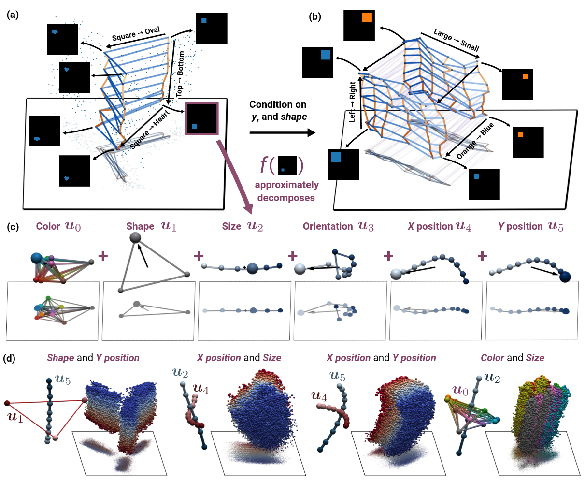
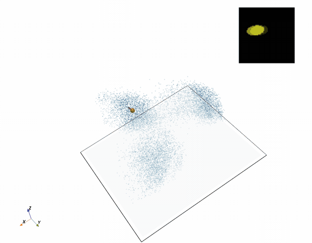

# Compositional Generalization Requires Linear, Orthogonal Representations in Vision Embedding Models

<p align="center">
  
</p>

This repository contains the empirical pipeline for the pre-trained models experiments (Section 5 of the paper).

## Setup

```bash
uv sync
source .venv/bin/activate
```

## Data

### Dataset paths

Dataset paths are configured in [`src/complinearity/_config.py`](src/complinearity/_config.py). Update these to match your local setup before running any experiments.

### Datasets

- **dSprites**: Download our cleaned variant [here](https://www.dropbox.com/scl/fo/vqcfgns0054q77mmj5zxz/AIvEvP1BWKqZE5FDooi7hmY?rlkey=vdyym0kwbigsbigelwca6a8nf&dl=0).
- **MPI3D**: Download `real.npz` from the [MPI3D repository](https://github.com/rr-learning/disentanglement_dataset).
- **PUG Animals**: See the [PUG benchmark](https://pug.metademolab.com/).

## Pipeline

<p align="center">
  
</p>

The main pipeline has three stages: generate embeddings, train linear probes, and run the factorization analysis. All commands assume you are at the repo root.

### 1. Generate embeddings

Extracts embeddings from all models (CLIP, OpenCLIP/SigLIP, DINOv2) for one or more datasets:

```bash
./src/complinearity/run_all_models.sh clean_dsprites
```

To run multiple datasets and/or override the output directory:

```bash
OUT_DIR="$PWD/outputs/clip_models_laion" \
  ./src/complinearity/run_all_models.sh clean_dsprites mpi3d pug
```

Supported datasets: `clean_dsprites`, `mpi3d`, `pug`.

### 2. Train probes

Trains per-concept linear probes on the extracted embeddings:

```bash
VAL_SPLITS="0.05" \
  ./src/complinearity/run_all_probes.sh clean_dsprites
```

Outputs are written to `outputs/clip_models_laion/<dataset>/_probes_*`.

### 3. Run factorization analysis

Evaluates the linear factorization and orthogonality metrics from the paper, and extracts ranks per concept:

```bash
./src/complinearity/run_all_analyses_simple.sh clean_dsprites
```

## Models

The default model set includes:

| Backend | Model | Pretrained weights |
|---------|-------|--------------------|
| CLIP | ViT-B/32 | OpenAI |
| CLIP | ViT-L/14 | OpenAI |
| OpenCLIP | ViT-B-32 | LAION-400M |
| OpenCLIP | ViT-B-16 | LAION-400M |
| OpenCLIP | ViT-L-14 | LAION-2B |
| OpenCLIP | SigLIP-Large-Patch16-256 | WebLI |
| OpenCLIP | SigLIP2-Large-Patch16-384 | WebLI |
| DINOv2 | ViT-S/16 | — |
| DINOv2 | ViT-B/16 | — |
| DINOv2 | ViT-L/16 | — |

## Citation

